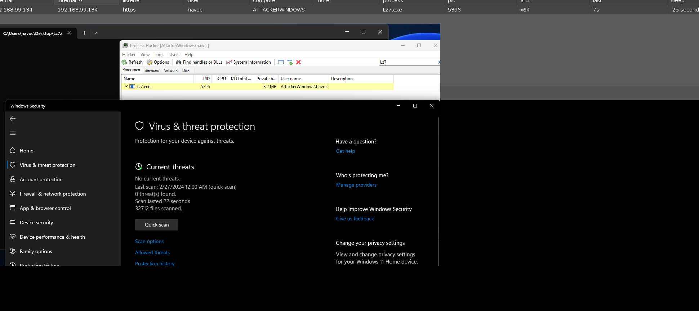

> DISCLAIMER: This tool is intended for security research and educational purposes only, and the user is solely responsible for all legal and related liabilities arising from the use of this tool. The author assumes no responsibility for any legal liability and reserves the right to suspend, modify or terminate this tool at any time. Users should comply with local laws and regulations, and understand and agree to all the contents of this statement.


Cobalt Strike plugin to quickly generate a beacon that evades antivirus software. bypasses windows defender.




# Install

```
cd /home/kali
git clone https://github.com/yutianqaq/CSx4Ldr
cd CSx4Ldr
wget https://ziglang.org/builds/zig-linux-x86_64-0.12.0-dev.3033+031f23117.tar.xz
tar -xf zig-linux-x86_64-0.12.0-dev.3033+031f23117.tar.xz
```


Modify 65 rows (`path/to/zig` -> `/home/kali/CSx4Ldr/zig/`)

Modify 73 rows e.g. (`path/` -> `/home/kali`)

```

			$cmd = "path/to/zig build-exe /tmp/temp.zig -fstrip -fsingle-threaded --name x4Ldr -target x86_64-windows";
...[snip]...
       	exec($cmd, $null, "path");
```

After loading, the tool will appear in Attack -> CSx4Ldr.

You can also use the shortcut Ctrl + J.


# References

https://github.com/RCStep/CSSG

https://github.com/hack2fun/BypassAV
